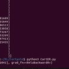
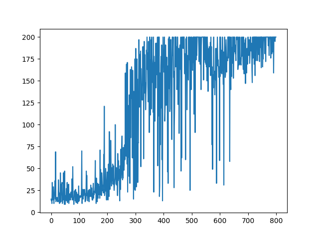

# Cartpole-v0

Implementing DQN (with *Experience Replay* and *fixed Q targets*)

## Model Architecture

* Input - 4  
* 1st Hidden Layer - 6  
* Output - 2

The agent was trained for around 800 episodes,
Stochastic Gradient Descent was used with a learning rate of 0.05

## Results

The above episodes v/s rewards graph was obtained during training  
And the Agent gets a average reward of 198 across 100 episodes on evaluation

