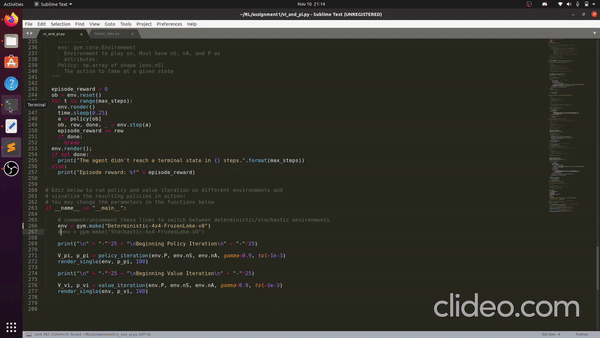
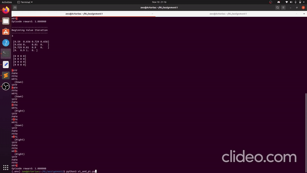
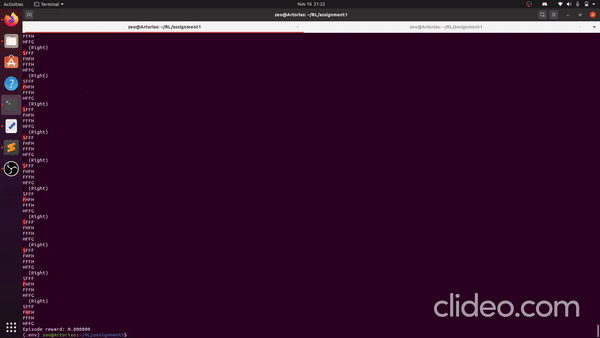

# CS234 Frozen Lake

A solution to CS234 Reinforcement Learning's Frozen Lake assignment
(Control by Dynamic Programming)

Implementation of:
* Policy Evaluation
* Policy Improvement
* Policy Iteration
* Value Iteration

## Result on 4x4 Deterministic Case

## Result on 8x8 Deterministic Case

## Result on Stochastic Case
The Stochastic Case does not always find the goal and often ends up in holes. However the Value function does converge.

