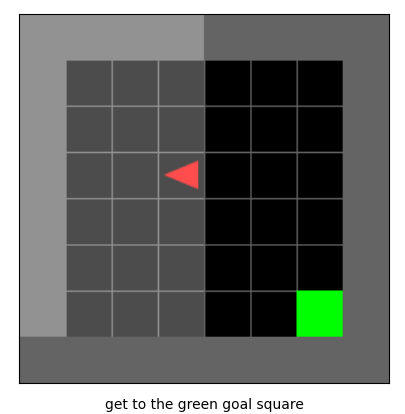
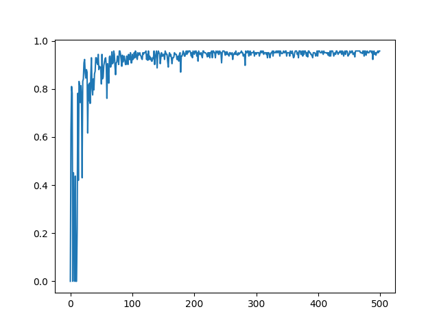
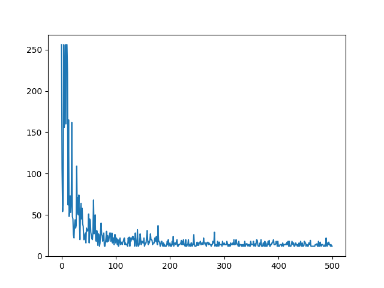
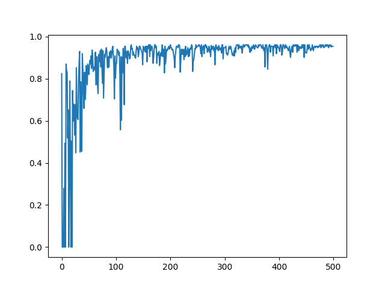
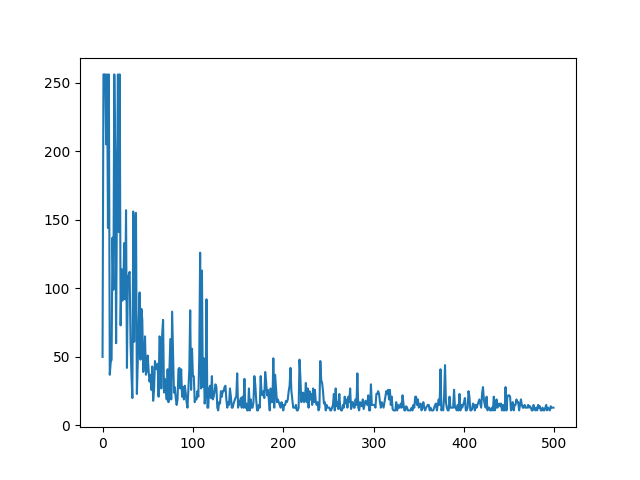

# Empty Room

Implementing RL algorithms on the [MiniGridWorld](https://github.com/maximecb/gym-minigrid) environment.  

Algorithms Implemented: 
 - Q-learning
 - One step SARSA

## Q-learning

The following results were obtained from Q-learning on the Empty Room.  
Rewards per episode V/s number of episodes:  

Steps per episode V/s number of Episodes:   (episode terminates if steps more than 256)

## One Step Sarsa

The following results were obtained from SARSA on Empty Room.   
Room.  
Rewards per episode V/s number of episodes:  

Steps per episode V/s number of Episodes:   (episode terminates if steps more than 256)
